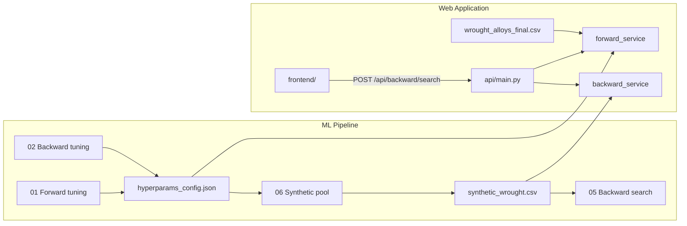

# Alloy Property Prediction (Wrought)

Machine learning pipeline for **wrought aluminum alloys**: predict properties from composition (forward) and discover candidate recipes from target properties (backward). The project includes a **Jupyter research pipeline**, a **FastAPI backend**, and a **web frontend** for backward alloy search.

---

## Overview

| Layer | What it does | How you use it |
|-------|----------------|----------------|
| **Notebooks** | Tune models, build synthetic search pool, offline analysis | Jupyter / `run_full_pipeline.py` |
| **Backend (API)** | HTTP endpoints for forward predict & backward search | `uvicorn api.main:app` |
| **Frontend (UI)** | Form for target properties → displays top alloy candidates | http://localhost:8000 |



---

## Quick start (Web app)

**Fastest path:** run the API + UI after the data pipeline has been executed at least once.

```bash
cd e:\vnit-intern\project_arch

pip install -r requirements-api.txt
pip install pandas numpy scikit-learn xgboost openpyxl

uvicorn api.main:app --reload --host 0.0.0.0 --port 8000
```

| URL | Purpose |
|-----|---------|
| http://localhost:8000 | **Frontend** — backward property search UI |
| http://localhost:8000/docs | **API docs** — Swagger UI |
| http://localhost:8000/health | Health check (models + pool status) |

1. Wait for server startup (~15–30 s while forward models train).
2. Open http://localhost:8000 — status should show the search pool is loaded.
3. Enter targets (e.g. **UTS 550**, **YS 400**) and click **Find alloys**.

---

## Backend (FastAPI)

### Architecture

The backend lives under [`api/`](api/) and is served by a single uvicorn process. On startup it:

1. Loads [`wrought_alloys_final.csv`](wrought_alloys_final.csv) and trains per-target regressors using [`hyperparams_config.json`](hyperparams_config.json) ([`forward_service.py`](api/forward_service.py)).
2. Loads [`synthetic_wrought.csv`](synthetic_wrought.csv) into memory for backward search ([`backward_service.py`](api/backward_service.py)).
3. Mounts the [`frontend/`](frontend/) folder as static files at `/`.

### API endpoints

| Method | Path | Description |
|--------|------|-------------|
| `GET` | `/health` | Server status, model count, pool row count |
| `POST` | `/api/forward/predict` | Composition (12 elements) → predicted properties |
| `POST` | `/api/backward/search` | Target properties + `top_k` → ranked candidate alloys |
| `POST` | `/api/backward/pair-search` | Two properties with ±tolerance band → best match or none |

### Request / response examples

**Backward search** (used by the frontend):

```json
POST /api/backward/search
{
  "targets": { "UTS (MPa)": 550, "YS (MPa)": 400 },
  "top_k": 3
}
```

Response includes `candidates[]` with `composition`, `properties`, `recipe`, `total_error`.

**Forward predict**:

```json
POST /api/forward/predict
{ "Al": 90, "Zn": 5.5, "Mg": 2.5, "Cu": 1.5, "Cr": 0.2 }
```

### curl (Windows PowerShell)

```powershell
curl http://localhost:8000/health

curl -X POST http://localhost:8000/api/backward/search `
  -H "Content-Type: application/json" `
  -d '{"targets": {"UTS (MPa)": 550, "YS (MPa)": 400}, "top_k": 3}'

curl -X POST http://localhost:8000/api/forward/predict `
  -H "Content-Type: application/json" `
  -d '{"Al": 90, "Zn": 5.5, "Mg": 2.5, "Cu": 1.5, "Cr": 0.2}'
```

### Backend dependencies

| File | Role |
|------|------|
| [`api/main.py`](api/main.py) | Routes, CORS, lifespan, static file mount |
| [`api/schemas.py`](api/schemas.py) | Pydantic models |
| [`api/forward_service.py`](api/forward_service.py) | Train & predict from composition |
| [`api/backward_service.py`](api/backward_service.py) | Search synthetic pool |
| [`utils.py`](utils.py) | Load/save `hyperparams_config.json` |
| [`synthetic_generation_core.py`](synthetic_generation_core.py) | Shared model builders, data loaders |

**Required data files for full API functionality:**

| File | Required for |
|------|----------------|
| `hyperparams_config.json` | Forward (run notebook 01) |
| `wrought_alloys_final.csv` | Forward training |
| `synthetic_wrought.csv` | Backward search (run notebook 06) |

---

## Frontend (Web UI)

### What it does

The frontend is a **static** HTML/CSS/JS app (no npm build). It implements **backward search only**: you enter desired property values and receive the closest matching alloy compositions from the synthetic pool.

### Files

| File | Role |
|------|------|
| [`frontend/index.html`](frontend/index.html) | Property form, results panel, API status |
| [`frontend/styles.css`](frontend/styles.css) | Layout and candidate cards |
| [`frontend/app.js`](frontend/app.js) | Calls `/health` and `/api/backward/search` |

### User flow

1. Page loads → `GET /health` shows pool status.
2. User fills any subset of 13 property fields (empty fields are ignored).
3. User selects **Top candidates** (1–10) and clicks **Find alloys**.
4. `POST /api/backward/search` returns candidates rendered as cards:
   - Rank and total error (lower is better)
   - Recipe string (e.g. `Al=93.59%, Cu=1.70%, …`)
   - Composition table (12 elements)
   - Matched property values

### Property fields (exact column names)

- UTS (MPa), YS (MPa), Fatigue Strength (MPa), Shear Strength (MPa)
- Y (GPa), G (GPa), Density (g/cc), Cp (J/kg-K), TC (W/m-K), TE Coeff
- Thermal Diffusivity , EC Volume (% IACS), EC Weight (% IACS)

Default example values: **UTS 550**, **YS 400** (from notebook 05).

### Connection to backend

The UI uses **same-origin** requests (`API_BASE = ''`) because FastAPI serves both the static files and the API on port 8000. No separate frontend dev server or extra CORS setup is needed.

---

## ML pipeline (Notebooks)

Use notebooks for tuning, pool generation, and offline analysis. Run **01 → 02 → 06** before backward search (notebook 05 or the web UI).

### Prerequisites

- Python 3.8+
- Jupyter (or VS Code with Jupyter)

```bash
pip install pandas numpy scikit-learn xgboost matplotlib seaborn openpyxl jupyter
```

### Execution order

| Step | Notebook | Output |
|------|----------|--------|
| 1 | `01_hyperparameter_tuning_forward.ipynb` | `wrought.by_target` in `hyperparams_config.json` |
| 2 | `02_hyperparameter_tuning_backward.ipynb` | `backward.wrought.{GMM,BGMM}` in config |
| 3 | `06_generate_synthetic_wrought.ipynb` | `synthetic_wrought.csv` (search pool) |
| 4 (opt.) | `07_generator_consistency_report.ipynb` | Generator stability CSVs |
| 5 | `05_backward_wrought.ipynb` | Top candidates for `TARGETS` dict |
| (opt.) | `03_forward_wrought_alloys.ipynb` | Predict properties from composition |

### One-line notebook sequence

```bash
cd e:\vnit-intern\project_arch

jupyter nbconvert --to notebook --execute --inplace 01_hyperparameter_tuning_forward.ipynb
jupyter nbconvert --to notebook --execute --inplace 02_hyperparameter_tuning_backward.ipynb
jupyter nbconvert --to notebook --execute --inplace 06_generate_synthetic_wrought.ipynb
```

Then use **05_backward_wrought.ipynb** or the **web UI** at http://localhost:8000.

### Pipeline scripts (no Jupyter UI)

```bash
python run_pipeline.py          # Quick: 01 → 02 → 06 → 05 check
python run_full_pipeline.py       # Full notebook execution with timeouts
python run_demo.py                # Minimal forward demo on wrought data
```

---

## Data files

| File | Description |
|------|-------------|
| `wrought_alloys_final.csv` | Real wrought compositions and measured properties |
| `synthetic_wrought.csv` | ~50k synthetic alloys (composition + predicted properties) |
| `hyperparams_config.json` | Per-target model choices and backward generator settings |

---

## Project structure

```
project_arch/
├── README.md
├── requirements-api.txt
│
├── frontend/                       # Web UI (backward search)
│   ├── index.html
│   ├── styles.css
│   └── app.js
│
├── api/                            # FastAPI backend
│   ├── main.py                     # App, routes, serves frontend/
│   ├── schemas.py
│   ├── forward_service.py
│   └── backward_service.py
│
├── utils.py
├── synthetic_generation_core.py
├── hyperparams_config.json
├── wrought_alloys_final.csv
├── synthetic_wrought.csv
│
├── run_demo.py
├── run_pipeline.py
├── run_full_pipeline.py
│
├── 01_hyperparameter_tuning_forward.ipynb
├── 02_hyperparameter_tuning_backward.ipynb
├── 03_forward_wrought_alloys.ipynb
├── 05_backward_wrought.ipynb
├── 06_generate_synthetic_wrought.ipynb
└── 07_generator_consistency_report.ipynb
```

---

## Troubleshooting

| Issue | Fix |
|-------|-----|
| UI shows pool not loaded | Run `06_generate_synthetic_wrought.ipynb` to create `synthetic_wrought.csv`, restart uvicorn |
| Forward endpoints return 503 | Ensure `wrought_alloys_final.csv` exists; wait for startup training to finish |
| No candidates / high error | Targets may be far from pool; try fewer properties or adjust values |
| Slow first request | Normal: models train once at API startup |

---

## License and attribution

Research/internship project (VNIT). Notebook pipeline for wrought alloys; API and frontend added for interactive backward search.

---

<div align="center">

<link href="https://db.onlinewebfonts.com/c/84fbf45e393ff3ea4ec1576159068637?family=DV_Divyae+Normal" rel="stylesheet" />

<p style="font-family: devnagri, 'DV_Divyae Normal', 'Noto Serif Devanagari', 'Mangal', serif; font-size: 2.75rem; font-weight: 400; color: #d4a017; margin: 0.6em 0 0.2em; text-shadow: 0 2px 12px rgba(212, 160, 23, 0.45); letter-spacing: 0.08em; line-height: 1.3;">
ॐ जय श्री कृष्ण
</p>

<p style="font-family: devnagri, 'DV_Divyae Normal', 'Noto Serif Devanagari', serif; font-size: 1.15rem; color: #8b6914; margin: 0; font-style: italic;">
Jai Shree Krishna
</p>

</div>
